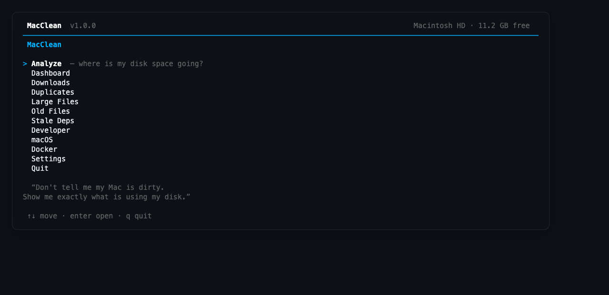
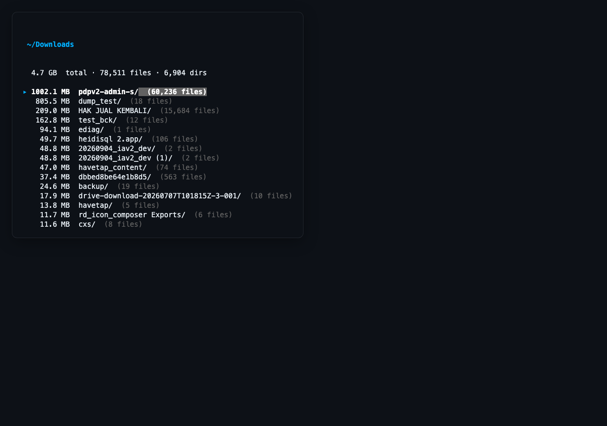
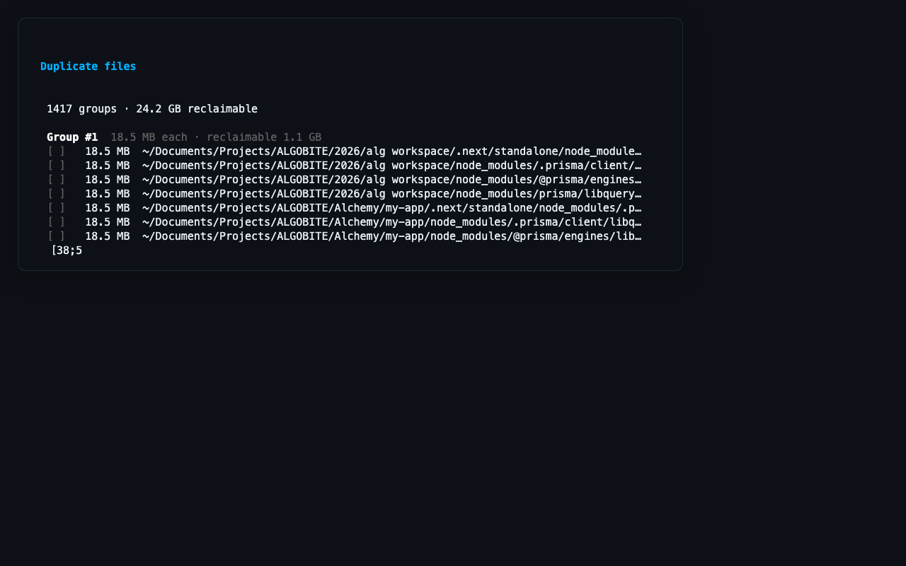
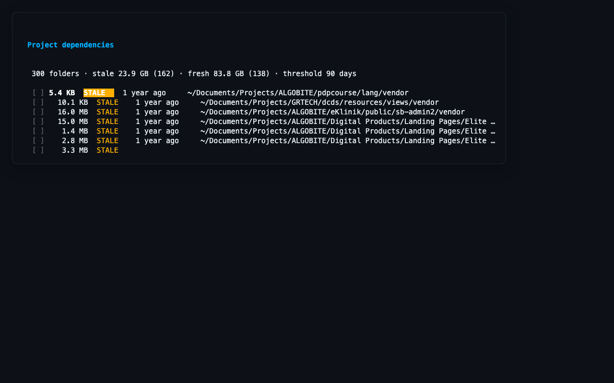
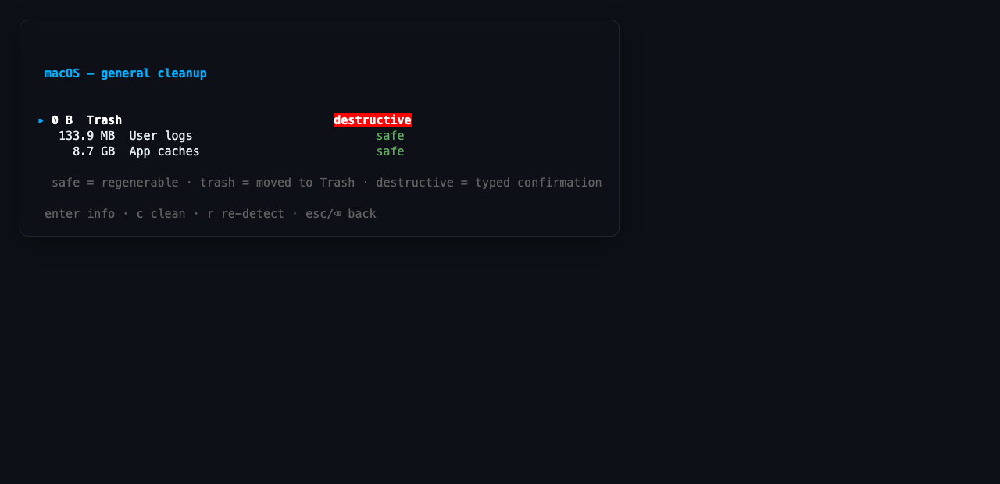
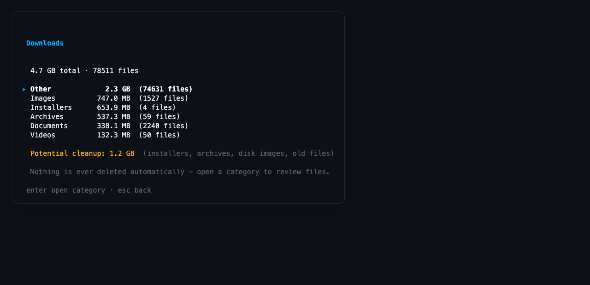

# MacClean

**See exactly what is using your disk.** A terminal disk explorer and
careful cleaner for macOS — not a "registry cleaner", not a system
optimizer. It answers real questions with real paths and real sizes:

- Where is my disk space going?
- Which folders are huge, and why?
- What downloads can I remove?
- Which files are byte-identical duplicates?
- Which projects (and node versions) have I stopped using?
- Which caches can I safely clean?
- How much space will I *actually* recover?

> Don't tell me my Mac is "dirty". Show me exactly what is using my disk.

macOS only (uses `~/.Trash`, Finder reveal, Darwin stat structures).
MIT licensed. Nothing is ever deleted automatically — you inspect, you
decide.

> [!WARNING]
> **USE AT YOUR OWN RISK — this tool can permanently delete your data.**
> Cleanups like emptying the Trash, destructive items, or `--hard` removals
> are **irreversible**. Always review the paths and sizes shown before
> confirming. The authors accept no liability for data loss. See the
> [safety model](#safety-model) for which actions are recoverable.

## Screenshots

| | |
|---|---|
|  |  |
| Main menu | Folder drill-down (`Analyze`) |
|  |  |
| Duplicates with suggested keepers marked | Stale project deps & nvm versions |
|  |  |
| General macOS cleanup (Trash, logs, caches) | Downloads by category |

More: [roots picker](docs/screenshots/roots.png) ·
[settings](docs/screenshots/settings.png)

## Install

**From source** (Go 1.24+):

```bash
git clone https://github.com/robiokidenis/macclean
cd macclean
go build -o macclean .
```

**go install** (after publishing to your fork):

```bash
go install github.com/robiokidenis/macclean@latest
```

Put the binary on your `PATH` and run `macclean` from anywhere.

## Quick start

```bash
macclean                    # interactive UI — the best way in
macclean analyze            # which user folders are largest?
macclean analyze ~/Projects # drill into one tree
macclean downloads          # what's rotting in ~/Downloads?
macclean duplicates         # byte-identical files (dev folders excluded)
macclean duplicates ~/Projects   # scan one specific folder
macclean duplicates --include-dev   # also scan node_modules/vendor/Pods
macclean deps               # node_modules/vendor/nvm by last use
macclean macos              # Trash, logs, app caches
macclean dashboard          # everything, deduplicated
```

Every command is read-only until you pass `--clean` (and even then it asks
first). JSON everywhere with `--json`.

## Using the interactive UI

`macclean` opens the menu: `Analyze`, `Dashboard`, `Downloads`,
`Duplicates`, `Large Files`, `Old Files`, `Stale Deps`, `Developer`,
`macOS`, `Docker`, `Settings`.

| Key | Action |
|-----|--------|
| `↑↓` / `jk` | move |
| `enter` | drill down / open |
| `esc` / `⌫` | up one level everywhere; from a top-level screen, back to the menu |
| `r` | (browser) re-scan the current root |
| `space` | select (file lists, duplicate copies, dep folders) |
| `d` / `t` | move selection to Trash (with confirmation) |
| `o` / `f` | open with default app / reveal in Finder |
| `i` | info: full path, size, dates, reinstall command, … |
| `s` | (duplicates) suggest: keep the oldest copy of each group |
| `/` | (stale deps) switch sort: last use ↔ size |
| `c` | (cleanup screens) clean the highlighted item |
| `r` | re-scan |
| `q` / `ctrl+c` | quit |

Scans show live progress (files, bytes, bar) and cancel with `esc`.

## CLI reference

```bash
macclean analyze [paths]           # largest folders + files (defaults to user dirs)
macclean large [--min-size 1GB]    # files above a threshold
macclean downloads                 # ~/Downloads categorized
macclean old [--days 180]          # not modified for N days (mtime, not atime)
macclean duplicates [--min-size 10MB] [--include-dev] [paths]
macclean deps [--days 90] [paths]  # node_modules, vendor, Pods, nvm versions…
macclean deps --clean <substring>  # trash matching stale entries (asks first)
macclean deps --clean <x> --hard   # delete instead of Trash
macclean macos [--clean trash|logs|caches]
macclean cleanup [--clean npm]     # developer caches via native commands
macclean scan [path] --json        # combined script-friendly report
macclean dashboard [--json]        # combined overview, deduplicated
macclean trash <paths>             # CLI trash helper
```

Common flags: `--json`, `--top N`, `--exclude NAME` (repeatable),
`--concurrency N`, `--rescan` (ignore the 15-minute result cache).

Example `scan --json`:

```json
{
  "path": "~/Downloads",
  "totalSize": 33787125760,
  "files": 12482,
  "largeFiles": [],
  "oldFiles": [ { "path": "...", "size": 1200000000, "mtime": 1740000000 } ],
  "duplicates": []
}
```

## How it works

### Folder analysis
Concurrent worker-pool traversal starting from known user directories —
never a blind whole-filesystem walk. Symlinks are never followed;
filesystem boundaries are not crossed by default; exclusions
(`node_modules`, `.git`, …) are configurable in Settings.

### Duplicate detection (staged funnel)
1. Group by exact size; singleton groups drop out immediately.
2. Hardlinks (same device+inode) collapse to one physical file.
3. Partial hash: first + last 64 KB.
4. Full streaming SHA-256, only for groups that survive stage 3.

Most of the disk is never read.

Dependency folders (`node_modules`, `vendor`, `Pods`) are **excluded by
default**: their contents repeat across projects *by design* — every
project ships its own copy of each package — so they are structural
duplicates, and deleting one copy breaks that project until reinstall.
The right cleanup unit for them is the whole folder (see *Stale deps*
below), or switch to a package manager with a content-addressable store
(pnpm, bun) which eliminates the duplication at the source. Use
`--include-dev` (CLI) or the `d` toggle on the Duplicates setup screen
(TUI) when you really want to inspect them; the results screen then warns
that they are structural.

In the TUI, `Duplicates` opens a small setup screen first: `enter` scans
the default roots, `p` scans any folder you type, `d` toggles dev folders.

### Stale project dependencies & toolchains
`node_modules`, `vendor` (Laravel/Composer), `Pods`, `target`, `build`,
`.next`, `.gradle`, `.terraform` and friends are regenerable with one
command — but only worth removing when the project itself is untouched.
Each folder gets a **last-activity** date (newest of the folder's mtime,
the project dir's mtime, and the manifest/lockfile mtimes), plus the exact
reinstall command detected from the lockfile (`npm ci`, `yarn install`,
`pnpm install`, `bun install`, `composer install`, `cargo build`, …).

The same screen covers **obsolete version-manager toolchains** — nvm,
pyenv, rbenv. A version is suggested only when it is not the manager's
default, no project pins it (`.nvmrc`; major-only pins like `18` protect
every `v18.x.y`), and it is older than the threshold.

### General macOS cleanup
Only well-known user areas: Trash (destructive — emptying is permanent,
typed `yes` required), `~/Library/Logs` (safe), `~/Library/Caches` (safe;
developer-tool subdirectories are skipped so they are never double-counted
or double-cleaned), and iOS device backups (destructive, moved to Trash).
`/System`, `/private`, `/bin`, `/sbin`, `/usr`, `/var` are never scanned.

### The honest dashboard
Categories overlap: one video can be *large*, *old*, in *Downloads*, and
half of a *duplicate pair* at once. Every category emits per-file claims
keyed by `(device, inode)`; **actual reclaimable is the union** — each
physical file counted exactly once.

```
Gross (categories summed)       247.0 GB
After overlap                   228.3 GB
```

## Safety model

> [!IMPORTANT]
> **Use at your own risk.** Despite every safeguard (Trash-first for user
> files, confirmations, protected paths), actions marked **destructive**
> delete data permanently. Back up before large cleanups.

| Class | Examples | Action |
|-------|----------|--------|
| Safe | build artifacts, package caches, logs, app caches | native command (`npm cache clean`, `go clean -cache`, …) or direct removal, after y/N |
| Trash | user files, downloads, duplicates, large/old files | moved to `~/.Trash` (recoverable), never `rm` |
| Destructive | Docker volumes, Xcode archives, emptying Trash, iOS backups | requires typing `yes` |

- No "clean everything" button. No automatic deletion. Ever.
- Every deletion path re-checks protected locations (`/System`, `/usr`,
  `/var`, …) before acting.
- **Database files are flagged, everywhere.** `.sql`, `.sqlite*`, MySQL
  `.ibd/.frm/.myd/.myi`, `.bson`, `.rdb/.aof`, Access files carry a `⚠db`
  badge in every list, and trash confirmations warn again — their
  "duplicates" are often intentional backups or live data.
- **Already-deleted entries are struck through** (`· deleted`) instead of
  silently reappearing from cached results, and every successful
  trash/clean invalidates the scan cache.
- Old files use **modification time** — access time is unreliable on
  modern macOS.

Settings live in `~/.config/macclean/settings.json` (thresholds, duplicate
roots, exclusions) and are editable from the UI.

## What's deliberately not in v1

- Similar-photo/video detection (perceptual hashing) — duplicates mean
  *identical content* only.
- Any cleanup you didn't explicitly confirm.

## Development

```bash
go build -o macclean .   # build
go test ./...            # unit tests (safe: fixtures under a temp home)
go test -race ./...      # the scanner and hasher are concurrent
```

Layout:

```
internal/
  scanner/     concurrent cancellable walker
  analysis/    large / old / downloads categorization
  duplicates/  staged size→partial→full SHA-256 finder
  devdeps/     stale project dependency & toolchain finder
  devcache/    developer cache detectors + native cleanups
  macos/       general macOS cleanup targets (Trash, logs, caches)
  dashboard/   overlap-aware combined overview
  fsutil/      protected paths, Trash, Finder, stat identity
  settings/    persisted user preferences
  report/      text/JSON rendering, result cache
  tui/         bubbletea interactive UI
main.go        CLI dispatch
```

## Contributing

Issues and PRs welcome — especially new cache detectors, version managers,
or duplicate-finder heuristics. Keep the philosophy: show real paths and
sizes, never delete without explicit confirmation, and keep system areas
untouchable.

## License

[MIT](LICENSE) © 2026 Robioki Denis
